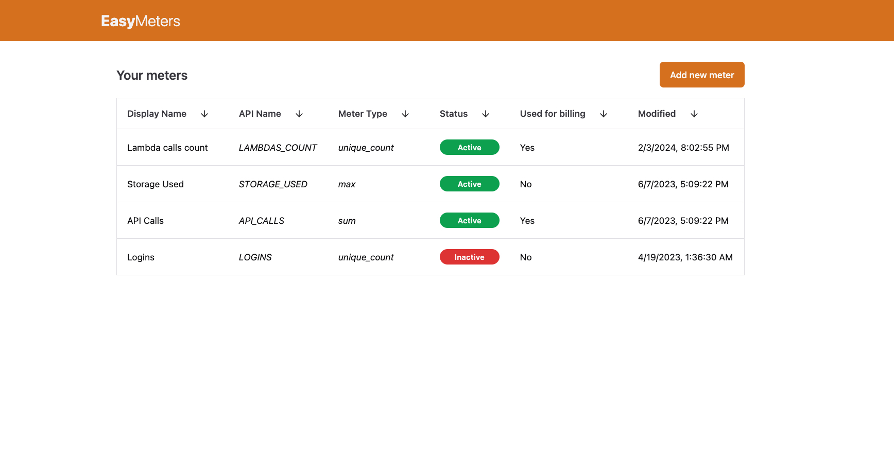
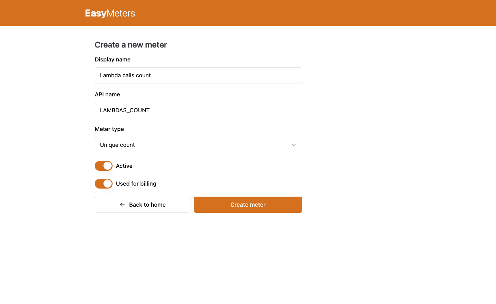
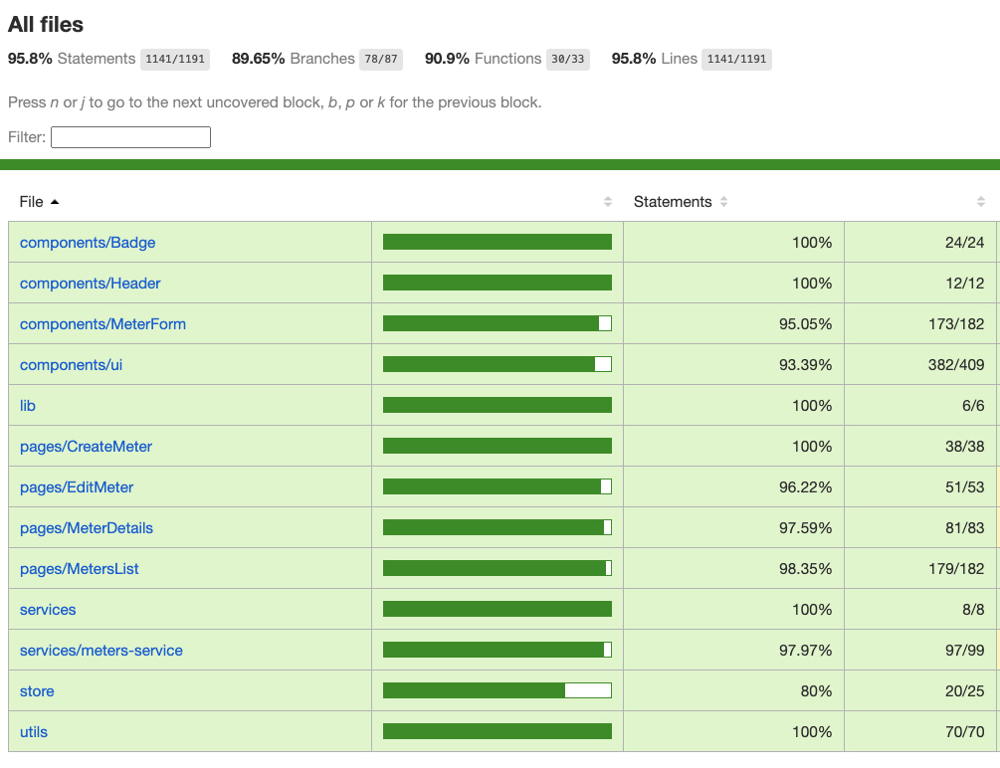

# Amberflo Front-end Challenge

<h4 align="center">
  A front-end application where users can manage their meters
</h4>

<p align="center">
  
</p>

This repo contains my code for the front-end challenge from Amberflo.
The challenge consists of a front-end application where the user can list, create, edit and see details of meters, which are provided from Amberflo's API.

<p align="center">
  <a href="#final-result">Final result</a>&nbsp;&nbsp;&nbsp;|&nbsp;&nbsp;&nbsp;
  <a href="#technologies">Used technologies</a>&nbsp;&nbsp;&nbsp;|&nbsp;&nbsp;&nbsp;
  <a href="#decisions">Decisions</a>&nbsp;&nbsp;&nbsp;|&nbsp;&nbsp;&nbsp;
  <a href="#features">Features</a>&nbsp;&nbsp;&nbsp;|&nbsp;&nbsp;&nbsp;
  <a href="#tests">Tests</a>&nbsp;&nbsp;&nbsp;|&nbsp;&nbsp;&nbsp;
  <a href="#deploy">Deploy</a>&nbsp;&nbsp;&nbsp;|&nbsp;&nbsp;&nbsp;
  <a href="#how-to-run">How to run</a>
</p>

<h2 id="final-result" name="final-result">
  ✅ Final result
</h2>

### [Click here to check the application running on Vercel](https://tiago-amberflo-challenge.vercel.app/)

Some screenshots from the application ⬇️

<strong>Home/Meters list page</strong> <br>


<hr>

<strong>Create meter page</strong> <br>


<hr>

<h2 id="technologies" name="technologies">
  🖥 Used Technologies
</h2>

- [React](https://react.dev/) to build the whole app in general.
- [TypeScript](https://www.typescriptlang.org/) to add static typing and catch errors on real-time.
- [Vite](https://vitejs.dev/) to setup the React application easier.
- [TailwindCSS](https://tailwindcss.com/) as CSS framework to style the interface.
- [React Testing Library](https://testing-library.com/) to create unit and integration tests for React components and hooks.
- [Vitest](https://vitest.dev/) as test runner.
- [shadcn/ui](https://ui.shadcn.com/) as UI components library.
- [Zustand](https://github.com/pmndrs/zustand) as global state manager.
- [Biome](https://biomejs.dev/) to lint and format the application code. Biome is a new tool written in Rust that was created with the goal of replacing ESLint and Prettier.
- [pnpm](https://pnpm.io/pt/) as package manager.

<h2 id="decisions" name="decisions">
  ⚖️ Decisions I took throughout the process
</h2>

- At first, I thought carefully about using or not an UI components library, however, when I thought how the pages would look, I realized I would need to have a lot of components, such as:
  - Table
  - Label
  - Input
  - Select
  - Switch
  - Button
  - Toasts

So I decided to use a components library, because if I made all these components myself, the time spent on the challenge would surely be more than the expected. The components library I chose was [shadcn/ui](https://ui.shadcn.com/) because of its great developer experience and simplicity.

- Since the form we have in the application would be very simple, I decided to not use a form management library in order to keep the code simpler and finish the challenge on time. The libraries that I would use to do this form validation are: [react-hook-form](https://github.com/react-hook-form/react-hook-form) and [zod](https://zod.dev/).

- Since I managed to develop the features in less than the expected time, I decided to add unit tests for the application, this led me to take a little bit longer to complete the challenge, but in return, the application code is much less prone to bugs. I am writing more about the tests in the section below: <a href="#tests">Tests</a>

<h2 id="features" name="features">
  📋 Features
</h2>

- [x] User can see a list of the meters
- [x] User can sort the list of meters by any column in the table
- [x] User can create a new meter
- [x] User can edit a meter
- [x] User can see the details of a meter

<h2 id="tests" name="tests">
  🧪 Tests
</h2>

As I mentioned before, since I managed to finish developing the features in less than the expected time, I decided to add unit (and some integration) tests for the application, this led me to take a little bit longer to complete the challenge, but in return, the application code is much less prone to bugs.

I added unit tests for pretty much everything I've coded myself. I just didn't add unit tests for the components under the `/src/components/ui` folder because those components are the ones taken from [shadcn/ui](https://ui.shadcn.com/), but even though I didn't add tests for them, their code was covered by other tests.

**The final code coverage of the application was 95%:**



<h2 id="deploy" name="deploy">
  🚀 Deploy
</h2>

I have deployed this application on [Vercel](https://vercel.com/). It's configured with a continuous deployment with this Github repository, that is, everytime the codebase from the `main` branch of this repository gets updated, Vercel will trigger a build of the project and will put it in production.
[Click here to check the application running on Vercel](https://tiago-amberflo-challenge.vercel.app/)

<h2 id="how-to-run" name="how-to-run">
  ⚙️ How to run
</h2>

### First steps

If you want to run the application in your computer, follow these steps:

First of all, you'll need to clone the repository and install the dependencies. Assuming you have [Node.js](https://nodejs.org/en) installed in your computer, follow the steps bellow:

```
# Clone the repo
$ git clone https://github.com/TiagoDiass/amberflo-frontend-challenge.git

# Enter the repo folder
$ cd amberflo-frontend-challenge

# Install the dependencies with your prefered package manager (I have used pnpm)
$ [npm | yarn | pnpm] install
```

### Application

After following the steps above, to run the application, just follow the steps below:

1. In the root folder of the project, create a `.env` file using the `.env.example` as an example. After completing the `.env`, it should look like this:

```
VITE_AMBERFLO_API_KEY=your-api-key
```

2. Open a terminal in the root of the project, and start the app by running:

```
# Start the app
$ [npm run | yarn | pnpm] dev
```

And there you go, the application should start running at `http://localhost:5173`

### Tests

To run the application tests, follow the steps below:

```
# Run the tests
$ pnpm test

# If you want to run the tests in order to see the code coverage, run:
$ pnpm test:coverage
```

The application coverage will be under the `/coverage` folder after running the `test:coverage` script.

## 👋🏻 Thank you!
